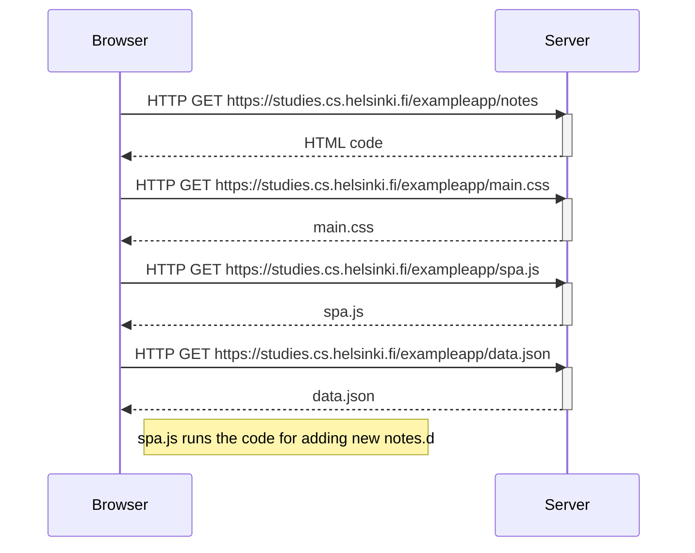

# SINGLE APP PAGE

```mermaid
sequenceDiagram
    participant B as Browser
    participant S as Server
    B->>S: HTTP GET https://studies.cs.helsinki.fi/exampleapp/notes
    activate S
    S-->>B: HTML code
    deactivate S
    B->>S: HTTP GET https://studies.cs.helsinki.fi/exampleapp/main.css
    activate S
    S-->>B: main.css
    deactivate S
    B->>S: HTTP GET https://studies.cs.helsinki.fi/exampleapp/spa.js
    activate S
    S-->>B: spa.js
    deactivate S
    B->>S: HTTP GET https://studies.cs.helsinki.fi/exampleapp/data.json
    activate S
    S-->>B: data.json
    deactivate S
    Note right of B: spa.js runs the code for adding new notes.d
```
