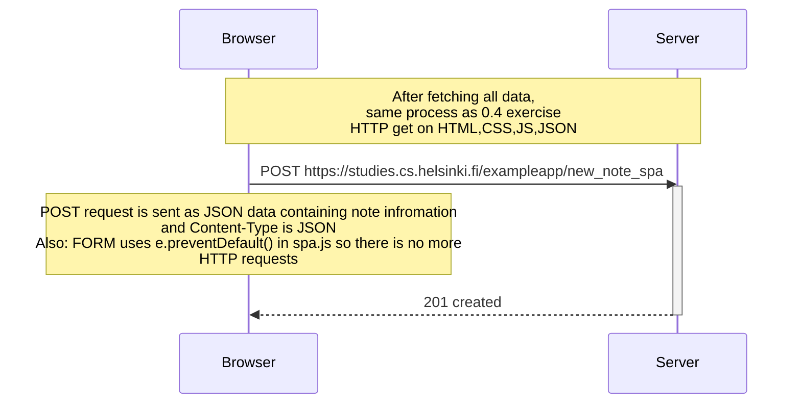

# SINGLE APP PAGE NEW NOTE

```mermaid
    sequenceDiagram
    participant B as Browser
    participant S as Server

    Note over B,S: After fetching all data,<br/>same process as 0.4 exercise <br/> HTTP get on HTML,CSS,JS,JSON

    B->>S: POST https://studies.cs.helsinki.fi/exampleapp/new_note_spa
    activate S
    Note over B: POST request is sent as JSON data containing note infromation <br/> and  Content-Type is JSON <br/> Also: FORM uses e.preventDefault() in spa.js so there is no more <br/>HTTP requests
    S-->>B: 201 created
    deactivate S

```
